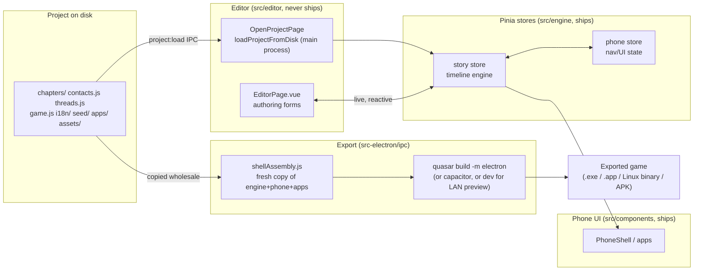

# Architecture

A technical map of the codebase for anyone picking this up cold — a contributor, a future
maintainer, or an AI agent working on the repo. It assumes nothing about prior context beyond
"this is a Quasar/Vue/Electron app." For the feature set from a _user's_ point of view, see the
[user guide](user-guide/README.md). For adding a new native app to the engine, see
[Building a native app in code](creating-custom-apps.md).

## Contents

- [The big picture](#the-big-picture)
- [The build boundary](#the-build-boundary)
- [Project data on disk](#project-data-on-disk)
- [The Pinia stores](#the-pinia-stores)
- [Three separate i18n systems](#three-separate-i18n-systems)
- [The timeline entry-type system](#the-timeline-entry-type-system)
- [The apps system](#the-apps-system)
- [Conditions, effects, flags, events](#conditions-effects-flags-events)
- [The build/export pipeline](#the-buildexport-pipeline)
- [Other subsystems](#other-subsystems)
- [Glossary](#glossary)

## The big picture

Stories Engine is two things wearing one Electron window:

1. **An editor** — a desktop app for authoring a visual-novel-style story presented as a fake
   smartphone (chapters, contacts, timeline entries, conditions/effects, custom apps...).
2. **A runtime engine** — the same fake-phone UI, minus the authoring chrome, that plays back
   whatever project the editor produced. This is what gets packaged into the Windows `.exe`, macOS
   `.app`, Linux binary, or Android APK a player actually runs.

Both live in the same `pnpm run dev:electron` process during development — the editor is really
just "the engine, with an authoring UI wrapped around a live instance of it, plus a build pipeline
that can eject a clean copy." That's the central fact this whole document explains: which source
directories are the _shipped_ engine, which are _editor-only_, and how the export step tells them
apart.



## The build boundary

Three top-level source areas, with one hard rule between them:

| Directory                                                                    | Ships in every export? | What it is                                                                                                                             |
| ---------------------------------------------------------------------------- | ---------------------- | -------------------------------------------------------------------------------------------------------------------------------------- |
| `src/engine/`                                                                | **Yes**                | The runtime: Pinia stores, app/entry-type registries, events, interactions, VFX kinds, i18n instance, `assets.js`.                     |
| `src/components/phone/` and `src/components/apps/`                           | **Yes**                | The phone shell UI and every native app (Messages, Pixly, Calls, Gallery, Journal, Email, Settings).                                   |
| `src/components/shared/`, `src/boot/`, `src/i18n/`, `src/css/`, `src/utils/` | **Yes**                | Small shared utilities, boot hooks, shipped-game chrome translations, global styles.                                                   |
| `src/editor/`                                                                | **Never**              | The authoring UI — forms, the chapter graph, the translation editor, cloud sync UI, everything under the `EditorPage.vue` tabs.        |
| `src/project/`                                                               | **Never**              | Editor-only pure-JS helpers (chapter-graph layout, search, validation, serialization) used by the authoring tools, not by the runtime. |

**Where this is actually enforced:** not by an ESLint rule (there isn't one) — by the copy list in
[`src-electron/ipc/shellAssembly.js`](../src-electron/ipc/shellAssembly.js)'s `assembleShell()`.
When building or LAN-previewing a project, that function copies, _by name_, exactly:

```
src/engine/  src/components/phone/  src/components/apps/  src/components/shared/
src/boot/    src/i18n/              src/css/               src/utils/
```

into a fresh temp shell (see [The build/export pipeline](#the-buildexport-pipeline) below).
`src/editor/` and `src/project/` are conspicuously absent from that list — not filtered out, just
never mentioned. So the rule in practice is: **if a file that ships imports anything under
`@/editor/` or `@/project/`, the app runs fine in the editor's own dev server (everything is on
disk there) but the exported game's build silently fails to resolve that import** — because the
copied shell genuinely doesn't have that directory. This has actually happened (see
`src/components/apps/email/EmailEntryForm.vue`'s history and the comment in `shellAssembly.js`
about why `src/components/shared/` — genuinely shared between editor forms and runtime plug-in
apps — was moved out from under `src/editor/` specifically to fix it) — it's a real failure mode,
not a hypothetical.

Practical rule for anyone adding code: **anything under `src/engine/`, `src/components/apps/`, or
`src/components/phone/` must only import from those same directories, `src/components/shared/`,
`src/i18n/`, `src/boot/`, `src/css/`, `src/utils/`, or third-party packages.** Never `@/editor/*`,
never `@/project/*`. If you need to share code between an editor form and a runtime app, it
belongs in `src/components/shared/` or `src/engine/`, not in `src/editor/`.

The **one deliberate exception** is `src/engine/assets.js` — see
[Asset resolution](#asset-resolution-the-one-legitimate-difference) below.

## Project data on disk

A project is a folder of plain JS/JSON files — nothing binary, nothing you can't read with a text
editor, so it's Git-friendly by design:

```
my-project/
├── project.json          # manifest: name, version, entryChapterId
├── contacts.js            # export default [{ id, name, color, pseudo, avatar, ... }]
├── threads.js              # export default [...] — only GROUP DM threads need an entry
├── game.js                # gameConfig: title, flags catalog, events, interactions, appOrder,
│                           #   disabledApps, matureContent, sounds, icon, entitySchemas...
├── chapters/
│   ├── chapter1.js         # export default { id, title, timeline: [...], next: [...], position }
│   └── ...                 # one file per chapter, freely nested in subfolders
├── seed/
│   ├── messages.js  dms.js  posts.js  reels.js  photos.js   # backlog content, pre-populated
├── i18n/
│   └── en-US/common.js, <chapterId>.js, ...    # narrative translation dictionaries
├── apps/
│   └── <id>.json           # no-code custom app definitions (blocks)
└── assets/
    └── images/ audio/ ...   # referenced by relative path from everywhere else
```

**Loading**: `src-electron/ipc/project.js`'s `loadProjectFromDisk(rootPath)` runs in Electron's
_main_ process (the renderer has no filesystem access). It dynamically `import()`s every `.js`
file — chapters (recursively, so authors can organize them into subfolders), `contacts.js`,
`threads.js`, `game.js`, every `seed/*.js` bucket, and every `i18n/<locale>/*.js` bucket — and
assembles one plain object:

```js
{
  ;(rootPath, manifest, chapters, contacts, threads, gameConfig, seed, i18n, assetsRoot, customApps)
}
```

It's round-tripped through `JSON.parse(JSON.stringify(...))` before crossing the IPC boundary —
partly to guarantee it's actually IPC-clonable (Electron's structured-clone can't carry functions
or class instances), partly as a cheap assertion that "chapters stay pure data" held (a chapter
file that exported a function or a Map would silently break here, on purpose).

The renderer's `story.loadProject(projectData)` action (in `src/engine/stores/story.js`) then just
does `Object.assign(this, defaultState()); this.project = projectData` — the store itself holds
**no hardcoded chapters/contacts/anything**. Every other store field is either transient session
state or accumulated player progress; `project` is the one field that's always fully replaced,
never merged, whenever a project (re)opens.

Saving works the same way in reverse: the editor mutates the live reactive `story.project` object
directly (form `v-model`s bind straight to `chapter.timeline[i].text`, etc. — see
`vue/no-mutating-props: shallowOnly` in `eslint.config.js`, which explicitly permits this), and a
"save" is `src/project/serializeChapter.js` turning that back into `export default {...}` source
text, formatted with Prettier, written to the right file by one of `project.js`'s
`project:save*` IPC handlers.

## The Pinia stores

Two stores, deliberately split by concern:

### `story` (`src/engine/stores/story.js`) — the timeline engine

This is the narrative runtime. The core loop:

- **`advance()`** — walks `chapter.timeline` from `timelineIndex` forward. For each entry: skip it
  if `checkConditions(entry.requires)` fails, skip it if its owning app is disabled, otherwise
  process it. Most entry types ("instant" ones — post/photo/story/reel/effect/non-blocking
  interaction) get a small `PACE_DELAY` (450ms) before advancing further so a burst of them
  doesn't all land in one frame. `message`/`dm`/`appDm` get a length-proportional typing delay
  first (`scheduleMessage`/`scheduleDm`/`scheduleAppDm`). `choice`/`call`/blocking `interaction`
  **block**: the index stays put and `advance()` returns, waiting for the player. When the
  timeline runs out of entries, it walks `chapter.next[]` (the arrows authored in the chapter
  graph) and takes the first whose `requires` passes; no match means this chapter is an ending —
  `activeEnding` is set from `chapter.endScreen` and `EndScreen.vue` takes over.
- **`processEntry(entry, chapter)`** — the actual per-type side effect (push a message, open a
  choice, ring a call, apply a VFX...). A `switch` over ~14 hardcoded types, with a `default` case
  that falls through to `CUSTOM_ENTRY_TYPE_BY_TYPE[entry.type]` for plug-in types (see
  [The timeline entry-type system](#the-timeline-entry-type-system)).
- **`runThen(list, i, chapter, resume)`** — plays a `then: []` array (attached to a choice option,
  an event, an interaction's win/lose branch) one entry at a time with the same pacing/blocking
  rules as `advance()`, recursively threading `resume` through arbitrarily deep nesting.
- **`checkConditions(requires)`** — evaluates `{ flags, following, collections }`, all ANDed
  together. See [Conditions, effects, flags, events](#conditions-effects-flags-events).
- **`applyEffects(effects)`** — the mutation side: flags (accumulate for numbers, set for
  booleans), flag-collection ops (add/remove/increment), phone-widget state (weather/steps/
  battery/network/clock), social deltas, new-follower notifications.
- **Save/load**: `save()` writes everything except `NON_PERSISTED_KEYS` (transient UI-ish state —
  `activeChoice`, `pendingCall`, notifications, typing indicators, etc.) to
  `window.storieGameSave`, a bridge that only exists in an _exported_ game (the editor's own live
  preview is purely in-memory). Three fixed save slots (`activeSlotId` picks which one `save()`
  writes to); `loadSlot(slotId)` restores a snapshot and re-runs `advance()` once (in case a
  chapter that had no valid outgoing edge when the save happened has one now). All state lives in
  one small `saves.json` under Electron's `userData` path, keyed by product name.

### `phone` (`src/engine/stores/phone.js`) — UI/navigation state

Deliberately separate from `story` so "which screen is open" never ends up in the save file:
`locked`, `currentApp`, which conversation/DM-thread/custom-app-thread is open, reboot state (used
to replay the boot animation after a Settings-triggered "reset phone" or "change save slot").
Emits `app.opened`/`app.closed` events (see [Events](#conditions-effects-flags-events)) through the
same lightweight pub/sub bus `story` also uses.

## Three separate i18n systems

Three genuinely independent translation mechanisms exist, on purpose — conflating any two of them
was tried informally in earlier design notes and rejected because switching one must never affect
the other:

| System                        | Location                                  | Drives                                                                                                                                                                              | Ships?                                   |
| ----------------------------- | ----------------------------------------- | ----------------------------------------------------------------------------------------------------------------------------------------------------------------------------------- | ---------------------------------------- |
| Shipped-game chrome           | `src/i18n/<locale>/index.js`              | vue-i18n instance (`src/engine/i18n/instance.js`) — boot screen, setup wizard, settings, native app labels. 5 locales: fr-FR (default), en-US, es-ES, de-DE, it-IT.                 | Yes                                      |
| Editor's own UI               | `src/editor/i18n/<locale>.js`             | The editor's labels/tooltips/dialogs — a **custom flat-lookup** (`editorT()`), not a second vue-i18n instance. Same 5 locales, switched independently in the editor's own settings. | Never                                    |
| A project's narrative content | project's own `i18n/<locale>/<bucket>.js` | `story.translateStory()`/`story.fill()` — the actual chapter text, contact bios, custom-app block text the author wrote. Any locale code the author adds.                           | Yes (it's project data, not engine code) |

**Why the editor UI isn't a second vue-i18n instance**: vue-i18n's "local scope" composer would
work, but every single descendant component in the tree has to re-declare
`useI18n({ useScope: 'local' })` in the right order — miss one and it silently falls back to the
_global_ (story/game) locale instead of erroring, a nasty bug across 30+ files. A flat reactive
`ref` + dot-path lookup (`src/editor/i18n/index.js`) has no such failure mode: `editorT('dialog.confirmDelete.title')`
looks up the current editor locale's dictionary, falls back to `fr-FR` (the always-complete
source) if the key is missing, then to the raw key string if it's missing everywhere — a visibly
wrong string during development beats a blank.

**How narrative translation actually resolves at runtime**: chapters are always _written_ in
French — French is the source-of-truth key, not a locale like the others. `resolveStoryText(i18nDict, locale, frText, bucket)`
in `story.js` looks up `frText` as a key inside `project.i18n[locale][bucket]`; `bucket` is either
the current chapter's id or `'common'` (contact bios, custom-app block text, anything not tied to
one chapter). No dictionary, no entry, or an empty stub — falls back to the French source itself,
so an untranslated project is still fully playable in French. `story.fill(text)` layers `{name}`
player-name interpolation on top of the same resolution.

**The `sharedOverrides.js` wrinkle**: some player-facing text is authored inside files that
_ship_ (`src/engine/events/triggers.js`'s trigger labels, a plug-in app's `entryType.js` label/
help — see `src/components/apps/email/entryType.js`). Those files can never import
`src/editor/i18n` directly (that's a `@/editor/*` import from a file that ships — exactly the
build-boundary violation described above). Instead `src/editor/i18n/sharedOverrides.js` looks up
an editor-side translation _for_ that trigger/entry-type name first
(`editorTOptionalPath(['triggers', trigger.name, 'label'])`), falling back to the original text
authored in the shared file if there's no override. The shared file's own text never has to know
the editor's translation layer exists.

## The timeline entry-type system

`TimelineEditor.vue` defines `BUILTIN_TYPES` — 17 hardcoded entry types as of this writing:
`message`, `choice`, `post`, `photo`, `story`, `dm`, `appDm`, `reel`, `call`, `effect`, `vfx`,
`music`, `timeskip`, `interaction`, `hallucination`, `fakeTyping`, `pause`. These stay hardcoded
deliberately — several encode delicate pacing/blocking mechanics (typing-delay scheduling,
blocking on player input, a multi-stage timeskip cinematic) that a new content type realistically
doesn't need to reinvent.

**The plug-in mechanism** (`src/engine/apps/entryTypeRegistry.js`) lets an app folder define an
_additional_ scriptable entry type with zero edits to `story.js`, `TimelineEditor.vue`,
`extractTranslatableStrings.js`, or `appIds.js`. Any `src/components/apps/*/entryType.js` is
auto-discovered via `import.meta.glob('/src/components/apps/*/entryType.js', { eager: true })` and
must default-export:

```js
{
  type: 'email',              // the entry.type value — unique
  app: 'email',                // which app id owns this (drives hiding it from the picker /
                                //   runtime-skipping it when that app is disabled)
  icon: 'mail', label: 'Email', help: '...',
  form: EmailEntryForm,        // the Vue component authoring this entry's fields
  defaultEntry(ctx),           // ctx = { firstContactId() } — fresh entry when added
  process(entry, ctx),         // ctx = { story, chapter } — the actual runtime side effect;
                                //   `story` is the FULL Pinia store, same access a built-in
                                //   type's processEntry case has
  extractText(entry),          // optional — string[] for the translation extractor
  collectReferences(entry),    // optional — [{kind:'contact'|'thread', id}] for search/refs
}
```

Every one of those 4 "mechanism" files has exactly **one** additive fallback reading this
registry, layered _on top of_ its existing hardcoded switch, never inside it — e.g. `story.js`'s
`processEntry` default case: `CUSTOM_ENTRY_TYPE_BY_TYPE[entry.type]?.process(entry, { story, chapter })`.
`src/components/apps/email/` is the reference implementation, built using only this documented
contract to prove it works end to end — see [Building a native app in code](creating-custom-apps.md)
for a full walkthrough.

## The apps system

**Native apps** (Messages, Pixly/social, Calls, Gallery, Journal, Email, Settings) each live at
`src/components/apps/<id>/` with a `manifest.js` (default-exports `{ id, order, labelKey, icon,
color, badge(story) }`) and an `App.vue`. `src/engine/apps/registry.js` auto-discovers every such
folder via two `import.meta.glob`s (manifests + components) — dropping a properly-shaped folder in
is enough to register a working app, no other file needs editing. A manifest with no matching
`App.vue` is skipped with a console warning rather than crashing.

**Custom apps** are the no-code equivalent: authored entirely inside the editor's "Apps" tab as a
tree of visual blocks (`header`, `text`, `image`, `row`, `card`, `layout`, `badge`, `divider`,
`button`, `tabs`, `list`, `conversations`, `schedule`, `ledger`, `form` — see
`src/engine/customApps/blockKinds.js`), stored as plain JSON at `apps/<id>.json` in the project, and
rendered by one generic interpreter, `CustomAppRenderer.vue` (the same component instance for every
custom app — same "one generic player driven by data" precedent as `InteractionPlayer.vue` for
interactions). A `list` block's `source` is one of `contacts`/`flagCollection`/`entity` — the last
iterates instances of an author-defined entity schema, see
[Entity schemas](#conditions-effects-flags-events) below. A `schedule` block reads ONE entity's own
`type: 'schedule'` field — an array of `{ from, to, place }` slots authored on the schema
(`EntityFieldInput.vue`) — and renders a day timeline, highlighting whichever slot covers
`story.resolvedClock()`'s current time (`ScheduleBlock.vue`); `entityId: '*'` picks the first/only
instance of the schema, same sentinel the `{entity:...}` token uses. When no chapter has overridden
the clock, `resolvedClock()` falls back to `new Date()`, which isn't itself reactive — `ScheduleBlock.vue`
polls a `tick` ref every 15s (read, unused, inside the `nowLabel` computed purely to register as a
dependency) to force re-evaluation as real time actually crosses a slot boundary, same cadence as
`StatusBar.vue`'s own clock display; without it the highlighted slot froze at whatever moment the
block last happened to re-render for an unrelated reason. A `ledger` block reads a
numeric `story.flagCollections[flagKey]` (`LedgerBlock.vue`, plain inline SVG, no chart library) —
the same collection a `list` block's `flagCollection` source already reads, just rendered as a
mini area-chart plus the entry list, coercing non-numeric entries to 0 for the chart only. A `form`
block is the first one the _player_ writes through instead of just reading — `target: 'flag'`
calls the new `story.setFlag(key, value)` (a real overwrite; `effects.flags` itself accumulates a
numeric delta, wrong semantics for "the player just typed 42"), `target: 'entity'` reuses
`effects.entities`'s existing `'set'` op unchanged. Its input widget is a plain native
`<input>`/`<select>`/switch button (`FormBlock.vue`) — same convention every other player-facing
field on the phone uses (`SetupWizard.vue`'s `.name-input`, Settings' `.switch`), not a Quasar form
component, which this phone UI never uses for player input. For an entity target the widget type is
read straight off the field's own declared schema type rather than asked again (schedule/
`ref:entity` fields are excluded — structured data, not a fit for one input). `block.commitMode`
(`'live'`/`'blur'`/`'button'`, default `'live'` for backward compatibility) controls when the typed
value actually reaches `story` — added after the original always-on-keystroke write turned out to
commit a half-typed or momentarily-empty value while the player was still editing; `'blur'` and
`'button'` buffer the raw input locally (`draft` ref in `FormBlock.vue`) until the native `change`
event or an explicit submit tap fires. `block.readonly` shows the current value with editing
disabled, for mixing an editable field with a computed one in the same visual style.

`EntityFieldInput.vue`'s `schedule` slot editor (from/to/place rows) lives inside whatever column
width its caller has — `EntitySchemaForm.vue`'s resizable splitter pane, or a dialog in
`EffectsBuilder.vue` — both ancestors set `overflow-x: hidden` (`.pane` in `EditorPage.vue`). The
slot row originally had no `flex-wrap`, so on a narrow column its two fixed-width time inputs
(`flex-shrink: 0`) plus the delete button overflowed and were silently clipped by that
`overflow-x: hidden` instead of reflowing — fixed by wrapping the row (`.schedule-slot`) and letting
the place field shrink (`flex: 1 1 140px; min-width: 0`).

**Per-app theme** (`customApp.theme`, edited in CustomAppEditor.vue's "Thème" panel): a small fixed
set of design tokens — a 5-role palette (background/surface/text/accent/danger), a font stack
(sans/serif/mono/rounded — real installed-font families, not live Google Fonts, since a packaged
export has no guaranteed internet access, see [Vendoring](#vendoring-why-no-internet-access-is-needed)),
a radius scale (sharp/normal/round), and a spacing scale (tight/normal/loose, applied to the root
screen's block gap only, not nested containers). `CustomAppRenderer.vue` resolves `theme` (entirely
optional — absent falls back to the engine's original literal defaults, byte-for-byte, so no
existing app's look changes) into CSS custom properties (`--app-accent`, `--app-surface`,
`--app-radius`...) set once on the screen's own root element; every `customApps/*` block component
just swaps a hardcoded literal for `var(--app-*)`, picking the value up through normal CSS
cascade/inheritance — no `provide()`/`inject()` plumbing needed the way `customAppNavigate` needs
one, since this is a pure styling concern. A block's own explicit color/radius (when the author set
one) still wins over the theme, which itself still loses to the engine's hard-coded fallback for
anything genuinely fixed by design (a badge's pill shape, an avatar's circle) rather than themed.

**Screen background** (pilier 03, first sub-feature): `screen.background` (an asset path, pre-
existing) now pairs with `screen.backgroundType` (`'image'`/`'video'`, default `'image'` for zero
migration) and `screen.backgroundOpacity` (0-100, default 100 — fully opaque, matching the original
always-opaque image). `CustomAppRenderer.vue` renders either an `` or a muted/looping/autoplay
`<video>` absolutely positioned behind `BlockList`, with `opacity` applied via inline style. Video is
a genuinely new asset category for this engine (nothing else — reels, photos — uses real video
files, those are all authored as static images) — `categorizeAsset()` gained a `video` bucket
(`mp4`/`webm`/`mov`), and `project:pickAsset`/`project:importAsset` (`src-electron/ipc/project.js`)
gained a matching file-dialog filter, mirroring the existing `audio` branch. `AssetField.vue` shows
a muted looping `<video>` preview the same way it already shows an `` for images.

**Sticky header/footer** (pilier 03, second sub-feature): `header` gains `block.sticky` (default
`false`, zero migration); a brand-new `footer` block type is `layout`'s exact shape (row/column,
its own `blocks[]`, optional `bgColor`) with `block.sticky` defaulting `true` instead — a non-sticky
footer would be indistinguishable from just placing a `layout` block last, so the toggle exists for
the rarer "footer-styled but not pinned" case. Both rely on plain CSS `position: sticky`, which
resolves against the nearest SCROLLING ancestor — `CustomAppRenderer.vue`'s `.app-screen`
(`overflow-y: auto`) already is one, so no new scroll-container plumbing was needed. Each needs an
opaque background so scrolled-past content doesn't show through underneath it while stuck — falls
back to the app's own `--app-bg` (same "absent = engine default" precedent as everywhere else) when
no explicit color is set. `footer` reuses the exact same `.blocks[]`/recursive-BlockList shape every
other container here does, so it's picked up for free by every generic block-tree walk that already
existed (asset collection, zip export/import, translation extraction, the drag/duplicate/condition
machinery) — no block-type-specific list anywhere needed a new entry, by design (see
`BLOCK_KINDS`/`BLOCK_COMPONENTS`, the only two places a block type is ever named explicitly).

**Overlay** (pilier 03, third sub-feature): `overlay` is a recursive container (own `blocks[]`, like
`card`) rendered `position: absolute` at one of 5 fixed presets (`block.anchor`:
`top-left`/`top-right`/`bottom-left`/`bottom-right`/`center` — `OverlayBlock.vue`'s
`ANCHOR_STYLES`). CSS `position: absolute` resolves against the nearest ancestor with
`position: relative` — `CustomAppRenderer.vue`'s `.app-screen` already is one (so an overlay at a
screen's own root level pins to a corner/center of the WHOLE screen), and `CardBlock.vue`/
`LayoutBlock.vue` now set it too (so an overlay nested inside either one pins to THAT container's
own corner/center instead — `LayoutBlock.vue` needed a `<style>` block for the first time, being
otherwise chrome-free by design). Deliberately not a free x/y coordinate or an anchor-to-any-block-
by-id system — nesting IS the anchor mechanism, the same "small bounded primitive over a more
powerful but far more complex alternative" trade this project keeps making (flags as the only
variable mechanism, blocks instead of a free canvas).

**Merged registry**: `story.mergedAppRegistry` (a getter on the `story` store) concatenates
`APP_REGISTRY` (native, code-defined) with `project.customApps` (author-built, JSON-defined),
normalized to the same `{ id, label, icon, color, badge, component }` shape so every consumer
(`PhoneShell.vue`, `HomeScreen.vue`, `SetupWizard.vue`, `GameForm.vue`'s Apps panel) treats them
identically. `story.orderedApps` applies the project's saved `game.appOrder`; `story.enabledAppIds`
filters out anything in `game.disabledApps` (an opt-_out_ list — absent means "show it," so a
project authored before a given app existed shows it with zero migration).

Disabling an app doesn't delete content that references it — a disabled app's already-authored
`message`/`post`/`appDm`/etc. entries stay in the chapter file untouched; `story.js`'s
`advance()`/`runThen()` silently skip them at runtime (same treatment as a failed `requires`),
so re-enabling the app later brings that content right back.

## Conditions, effects, flags, events

**Flags** are the project's variables. Three kinds share the concept ("created/labeled once in the
Flags panel, referenced by key everywhere") but are stored separately because `story.flags[key]`
is assumed numeric-or-boolean _everywhere_ it's read:

- **Numeric/boolean flags** — `story.flags[key]`. Effects either accumulate a numeric delta or
  _set_ a boolean (idempotent — a boolean effect firing twice doesn't double-toggle).
- **Flag collections** — `story.flagCollections[key]`, a `{ itemKey: value }` map, for
  history/ledger/inventory-shaped data. Three effect ops: `add` (auto-generates a key if left
  blank — the common "growing log" case), `remove`, `increment` (numeric delta on an existing
  key — the only op that reads-before-writing).
- **`following`** — not a flag at all, a _live_ signal (`story.isFollowing(contactId)`), since it
  can change between when a condition is authored and when it's actually evaluated.

**Entity schemas** (`game.entitySchemas[]`, edited in the Données tab's Schémas sub-tab) sit one
level above flags: a flag collection is a flat `{ itemKey: value }` map (one scalar per entry,
assumed everywhere it's read), but some data genuinely needs several _named, typed_ fields per
record — a character with a location and a mood, an item with a price and a quantity. A schema
declares `{ id, label, fields: [{ key, label, type }] }` (`type` ∈ `text`/`number`/`boolean`/
`schedule`/`ref:contact`/`ref:entity` — `schedule`'s value is an array of `{ from, to, place }`
slots, not a scalar, see [The apps system](#the-apps-system)'s `schedule` block); instances live
in `story.entities[schemaId][entityId] = { field: value
}`, a bucket of its own (not persisted-key-excluded, so it round-trips through save/load like
`flagCollections`). Two ways instances come to exist:

- **`schema.seed`** — `[{ entityId, fields }]` authored right on the schema, merged into
  `story.entities` once by `seedInitialContent()` at a fresh game's very first start — same
  "present before the timeline plays its first entry" precedent as `project.seed.messages`/`.dms`/
  `.posts` (see [Project data on disk](#project-data-on-disk)), just kept on the schema itself
  rather than in a generic bucket, since the field list an author needs is already right there.
- **`effects.entities`** — `[{ schemaId, entityId, mode: 'set'|'remove', fields }]`, the same
  "list of ops" shape `effects.collections` uses and for the same reason (one effect can touch more
  than one entity, or the same one twice). `'set'` merges `fields` onto whatever's already at that
  id (`Object.assign`, not overwrite) so an author can update a single field without
  re-specifying the rest; a blank `entityId` auto-generates one.

`story.entities` is a runtime SNAPSHOT taken from `schema.seed` — editing a seed instance's fields
after that snapshot exists (e.g. adding a `schedule` slot) mutates the schema's own `seed` template
but not the already-materialized snapshot. The editor's Apps-tab live preview
(`previewCustomApp()`/`EditorPage.vue`) re-derives that snapshot via `story.loadProject()` whenever
`selectedCustomApp` changes (switching apps), but originally missed the case where the author edits
a schema's seed data while staying on the SAME open app — the preview kept showing stale entities
until "Relancer l'aperçu" forced a reload. Fixed with a second `deep` watch on
`gameConfig.entitySchemas` alongside the existing one.

A schema has no visual representation on its own — it's consumed by a custom-app `list` block
(`source: 'entity'`, see [The apps system](#the-apps-system)) or by the
`{entity:<schemaId>:<entityId>:<field>}` token (`resolveDynamicText.js`), usable in any custom-app
text field, not just inside a list's per-item template — `entityId: '*'` reads the first/only
instance of that schema (`story.entityItems`, insertion order), useful for a singleton record (a
wallet, a settings object) with no id to type.

**Conditions** (`requires`) and **effects** — the same two builder components
(`RequiresBuilder.vue`/`EffectsBuilder.vue`) are reused everywhere a condition/effect can be
authored: chapter-graph arrows, timeline entries, choice options, custom-app block visibility,
custom-app buttons, events, interaction win/lose branches. `checkConditions()` ANDs every present
condition type together (`flags`, `following`, `collections`); there is deliberately no date/time
condition, no randomness, no "already seen" condition.

**Events** (`game.events[]`, edited in the Events tab) are the same
`requires`/`effects`/`then` trio, but triggered by a _player action_ instead of the timeline
reaching a specific point — `handleEngineEvent()` reuses `checkConditions`/`applyEffects`/`runThen`
exactly as a normal timeline entry would (see `docs/roadmap-modular-apps-events.md` §5: "don't
build a second narrative system"). Triggers are cataloged in `src/engine/events/triggers.js`
(`app.opened`, `app.closed`, `photo.viewed`, `post.liked`, `contact.followed`, `profile.opened`,
`conversation.opened`, `button.pressed`, `interaction.won`/`interaction.lost`) and dispatched
through a minimal pub/sub bus (`src/engine/events/eventManager.js`) that both `story.js` and
`phone.js` `emit()` into — deliberately _not_ a Pinia store, since neither store should depend on
the other just for this.

**Interactions** (`game.interactions[]`, the "Interactions" tab) are authored phone-gesture
sequences — `tap`/`hold`/`swipe`/`drag`/`wipe`/`code`/`wait`, a small bounded vocabulary
(`src/engine/interactions/stepKinds.js`), not free code. An `interaction` timeline entry
references a definition by id; blocking or parallel per-entry (`entry.blocking`).

## The build/export pipeline

`src-electron/ipc/shellAssembly.js`'s `assembleShell(tmpDir, rootPath)` is the single place that
knows what a shippable copy of Stories Engine is made of. It's shared by `build.js`'s "export
game" and `webPreview.js`'s "LAN preview" — one function, two different final commands.

1. Copy `templates/game-shell/` (a real, pre-vendored Quasar+Electron+Capacitor project skeleton
   with `node_modules` already installed — see [Vendoring](#vendoring-why-no-internet-access-is-needed))
   into a fresh temp directory.
2. Copy `src/engine`, `src/components/phone`, `src/components/apps`, `src/components/shared`,
   `src/boot`, `src/i18n`, `src/css`, `src/utils` from the _editor's own current source_ — **never
   a hand-maintained second copy**. Whatever the engine looks like right now is exactly what
   ships.
3. **Overwrite** the just-copied `src/engine/assets.js` with
   `templates/game-shell/engine-overrides/assets.js` — see below.
4. Copy the project's own data (`contacts.js`, `threads.js`, `game.js`, `project.json`,
   `chapters/`, `seed/`, `i18n/`, `apps/`) into `src/project-data/`, and `assets/` into
   `public/story-assets/`.
5. Stamp the shell's `package.json` with the project's own name/version (so the packaged binary's
   file metadata matches), copy a custom `.ico` if the author set one.
6. Run `quasar build -m electron` (export) or `quasar dev --hostname` (LAN preview) inside that
   temp dir, using a vendored Node.js binary — never the user's own Node/pnpm.

### Asset resolution: the one legitimate difference

`src/engine/assets.js` exports `resolveAssetUrl(relPath)`, and every component that shows a
project image/audio goes through it instead of using a raw path. It has to behave differently in
the two environments it runs in:

- **Editor's live preview**: resolves through Electron's custom `storie-asset://` protocol against
  whichever project is currently open (`src-electron/electron-main.js`'s protocol handler).
- **A shipped/exported game**: assets are baked into `public/story-assets/` at build time, so it
  just needs a plain relative path: `./story-assets/...` (relative, not root-absolute — a packaged
  Electron app loads `index.html` via `file://`, where a leading `/` resolves to the filesystem
  root, not the app folder).

Rather than branching inside `resolveAssetUrl` itself, `templates/game-shell/engine-overrides/assets.js`
holds the shipped-game version, and step 3 above **overwrites** the fresh copy of
`src/engine/assets.js` with it, _after_ the wholesale engine copy in step 2. Every other file that
imports `resolveAssetUrl` from `@/engine/assets` gets the right behavior in both contexts with zero
special-casing anywhere else — this is the **one file in the whole engine that legitimately
differs** between editor and shipped game, and the copy pipeline exists specifically to make that
difference invisible to everything else.

### Vendoring: why no internet access is needed

A packaged Stories Engine build (`.exe` on Windows, `.app` on macOS, a binary on Linux) runs on a
user's machine that may have no pnpm, no Node.js, and no guaranteed internet access — but
building/exporting a game still needs a real `node_modules`, a real Electron binary to package
into, and (for Android) a JDK+SDK. `pnpm run vendor:game-shell` does all of that heavy lifting
_once_, ahead of time, on the maintainer's machine, and the result ships as part of Stories Engine
itself, for every target platform:

- `templates/game-shell/node_modules` — a hoisted `pnpm install` of the shell's own
  `package.json`.
- `templates/game-shell/src-electron/node_modules` / `src-capacitor/node_modules` — `electron` +
  `@electron/packager` / Capacitor, pre-installed (④quasar build -m electron`'s packager step
  auto-installs these into that exact path on first run otherwise).
- `templates/game-shell/node-runtime/` — a genuine standalone Node.js binary (`node.exe` on
  Windows), run instead of Electron's own binary under `ELECTRON_RUN_AS_NODE=1` (confirmed to
  silently break `@electron/packager`, since `process.versions.electron`/`process.resourcesPath`
  stay defined even under that mode and something in the packager's dependency chain branches on
  them).
- `templates/game-shell/electron-cache/` — the exact Electron zip(s) `@electron/packager` needs,
  so it never falls back to its own network-downloading cache.
- Android's JDK/SDK are downloaded **on demand** instead (see `androidToolchain.js`) — too large to
  vendor unconditionally, fetched once per machine with a progress bar, same UX pattern as rclone
  for cloud sync.

## Other subsystems

- **Multi-slot saves** — 3 fixed local save slots, `saves.json` under Electron's `userData` path.
  Picked once per session on `SlotPickerScreen.vue`, switchable mid-game from Settings without
  losing the slot being left. See `story.js`'s `save()`/`loadSlot()`/`NON_PERSISTED_KEYS`.
- **Cloud sync** — push/pull a whole project to the author's own cloud account via a local
  [rclone](https://rclone.org/) daemon (`src-electron/ipc/cloudSync.js`,
  `docs/cloud-sync-rclone-plan.md`). Not a custom backend — rclone's own OAuth handles ~70
  providers. Editor-only tool, never ships.
- **LAN web preview** — `webPreview.js` runs the same `assembleShell()` output through
  `quasar dev --hostname` instead of `quasar build`, so a phone on the same Wi-Fi can open the
  project as a real page in a mobile browser — a more honest touch-UI test than the desktop
  Electron window.
- **Android export** — `build.js`'s Android target runs `quasar build -m capacitor -T android` on
  the same assembled shell, then `gradlew` directly, using the on-demand-downloaded JDK/SDK
  toolchain. Same shell, same project data, no second pipeline to maintain.

## Glossary

| Term                   | Meaning                                                                                                                                                                        |
| ---------------------- | ------------------------------------------------------------------------------------------------------------------------------------------------------------------------------ |
| **Chapter**            | A node in the story graph — an id, a title, a `timeline[]`, `next[]` outgoing edges, an optional `endScreen`.                                                                  |
| **Entry**              | One item in a chapter's `timeline[]` — a message, a choice, a VFX cue, etc. Has a `type` and an optional `requires`.                                                           |
| **Flag**               | A named variable (`story.flags[key]`), numeric or boolean, read by `requires` and written by `effects`.                                                                        |
| **Flag collection**    | A named `{key: value}` map (`story.flagCollections[key]`) for ledger/history-shaped data — the third flag kind.                                                                |
| **Entity schema**      | An author-defined record type (`game.entitySchemas[]`) — id/label + typed fields. Instances live in `story.entities[schemaId][entityId]`.                                      |
| **Requires**           | A condition object (`{ flags, following, collections }`) gating an entry, an edge, a choice option, a block, etc.                                                              |
| **Effects**            | A mutation object applied when an entry/option/event fires — flags, phone widgets, social deltas.                                                                              |
| **Entry-app**          | The native/custom app a timeline entry type is scoped to (`ENTRY_TYPE_APP`) — drives hiding it when that app is disabled.                                                      |
| **Plug-in entry type** | A scriptable timeline entry type contributed by an app's `entryType.js`, without touching the core engine switch.                                                              |
| **Custom app**         | An author-built phone app made of visual blocks, stored as `apps/<id>.json`, rendered by `CustomAppRenderer`.                                                                  |
| **Build boundary**     | The rule that `src/engine`/`src/components/{phone,apps,shared}` must never import `src/editor` or `src/project` — enforced by `shellAssembly.js`'s copy list, not a lint rule. |
| **Shell**              | The temp Quasar project `assembleShell()` produces — `templates/game-shell` + a fresh engine copy + the project's own data.                                                    |
