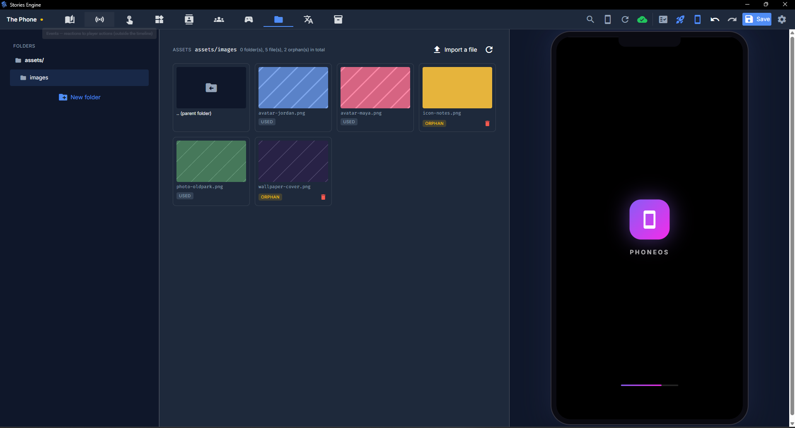
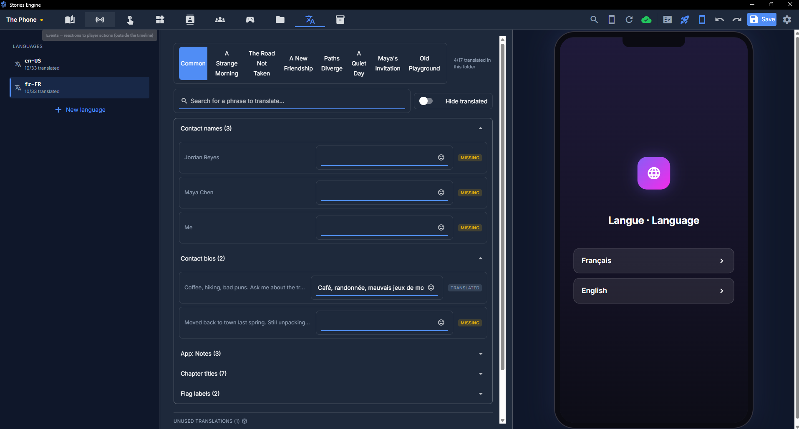
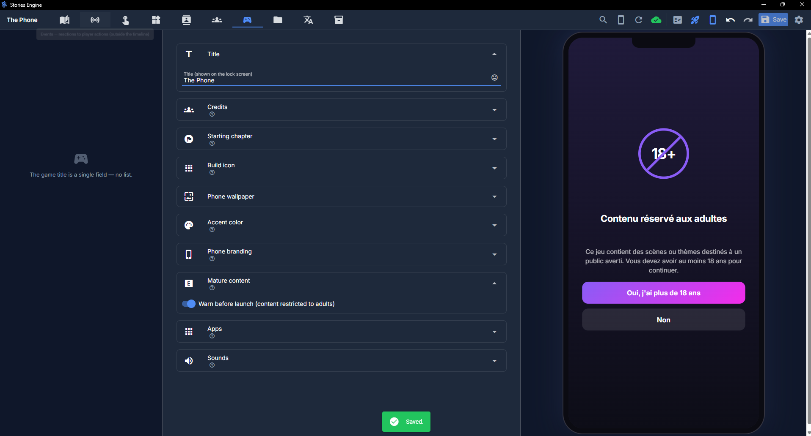

# Assets, sound, and translations

## Assets

Every image and audio file your story uses lives under your project's `assets/` folder, referenced
by every other part of the project (contact avatars, message/post images, music tracks) as a
relative path — never an absolute one, so a project stays fully portable between machines.

The **Assets** tab shows this folder as a browsable tree/grid, file-explorer style:

- **Import** copies a file from anywhere on your computer into the project (with a suggested
  subfolder — e.g. `images/<contact-id>/` when importing an avatar).
- **Browse** lets you reuse a file already in the project instead of importing a duplicate.
- Both offer an inline preview — an actual image thumbnail, or an audio player for sound files.
- Every asset is badged **used** or **orphaned** (nothing in the project currently references it).
  Only orphaned files can be deleted from here, and deletion always asks for confirmation first —
  it's not reversible.

### Sound

Stories Engine has a fixed catalog of **15 named sound effects** covering the phone's own
interactions — receiving/sending an SMS, receiving a DM, sending a social message, an incoming
ringtone, answering/hanging up a call, liking something, gaining a follower, tapping a story,
sharing a post, booting up, unlocking, a generic notification, low battery. Every one of them has a
sensible default built into the engine — you only need to visit the Game tab's sound panel if you
want to **override** a specific one with your own file for a given project; anything you don't
override just uses the engine's default.

### Music

Background music is authored as a `music` timeline entry (see
[Writing chapters](writing-chapters.md#the-timeline-and-its-entry-types)) rather than a project-wide
setting — start a track (with its own title, looping on/off, volume, and an optional fade-in) at
whatever point in the story makes sense, and stop it (with an optional fade-out) the same way. The
currently-playing track shows up as a "now playing" widget on the phone's home screen.

## Translations

Stories Engine has **three separate translation systems** that never affect each other — worth
understanding so you don't go looking for a setting in the wrong place:

1. **The phone's own interface** (boot screen, setup wizard, Settings app, native app labels) —
   built in, shipped with the engine, already fully translated into 5 languages (French, English,
   Spanish, German, Italian). You don't do anything for this one; it's just there.
2. **The editor's own interface** (this app's own menus/labels/tooltips) — a separate setting, in
   the editor's own Settings, that only changes what *you* see while writing. It has nothing to do
   with what language your finished story ships in.
3. **Your story's own narrative content** — everything *you* wrote: chapter text, contact bios,
   custom-app text. This is what the **i18n** tab is for, and it's the one you actually work with
   as an author.

### How narrative translation works

Whatever language you originally wrote your story in is the **source** — every dictionary entry is
keyed by that exact source text. Adding a language to your project (limited to the same 5 the
phone interface already supports — otherwise the menus around your text would stay untranslated for
players using that language) gives you one dictionary per **bucket**: one per chapter, plus a
shared "common" bucket for text that isn't tied to one chapter (contact bios, custom-app text).

The i18n tab's editor per language/bucket gives you:

- Search, and a "hide already translated" filter so you can focus on what's left.
- Grouping by where a string came from, in the common bucket.
- Detection of **orphaned** entries — translations that no longer match anything in the current
  source text (usually because you edited the original line since translating it).
- The same emoji picker button found on every text field elsewhere in the editor.

A player can switch language **at any time** from Settings, mid-playthrough, with no reset — and
any line you haven't translated yet just falls back to your original source text rather than
showing up blank, so an incomplete translation never breaks the game.

### Removing a language

You can delete a language you've added to a project at any point — this permanently discards every
translation you made for it, so the editor asks for confirmation first.

## Mature content warning

If your story has content you want to gate behind an age check, the Game tab has a **mature
content** toggle (`matureContent`). When enabled, a dedicated 18+ warning screen appears before
*everything else* — before the save-slot picker, before the boot animation, before the setup
wizard. It auto-detects the player's device language for its own text (this happens before the
setup wizard would otherwise ask). Declining blocks the current session outright with no way
around it; closing and relaunching the game gives the player a fresh chance to accept.

## Next steps

- [Building and exporting](building-and-exporting.md) — assets are baked into your exported game
  automatically; nothing extra to do there.
- [Publishing checklist](publishing-checklist.md) — a final pass to make before sharing your story.
