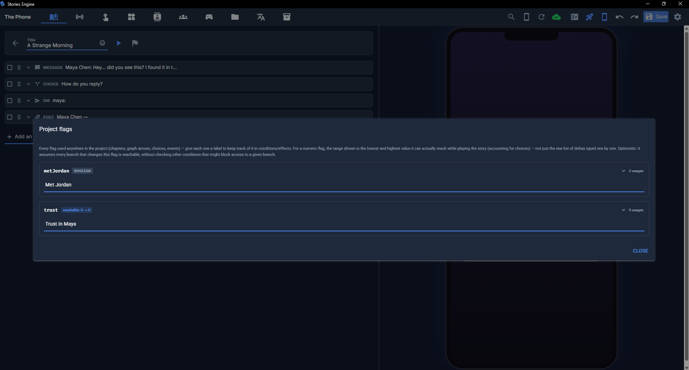
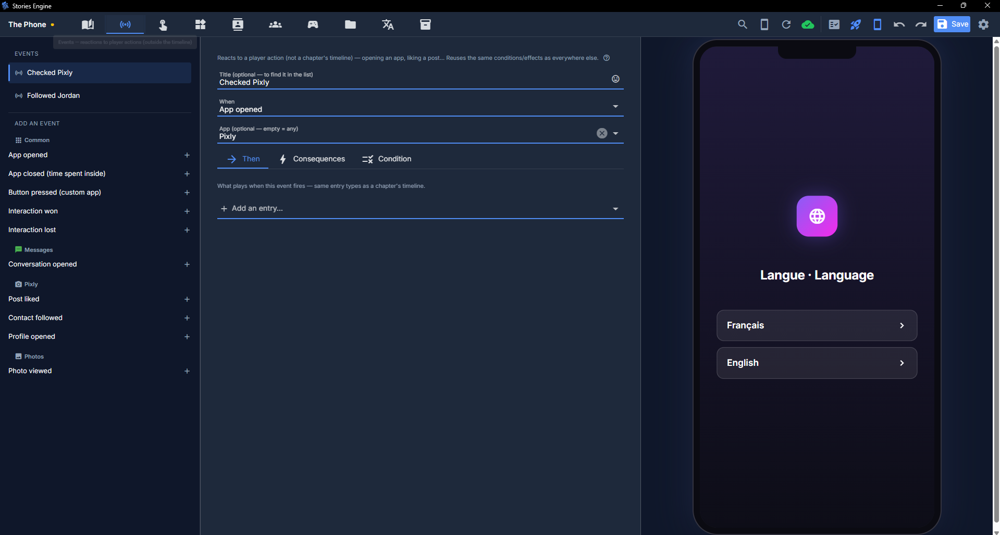
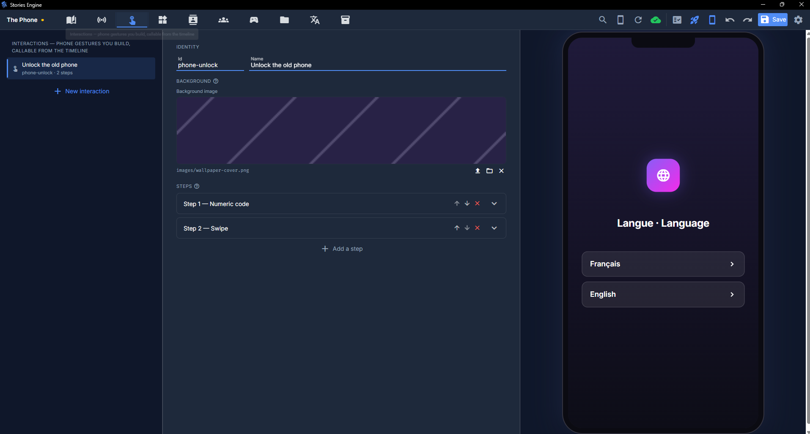

# Conditions, flags, and reactions

This is what makes a story actually branch: remembering what the player has done (flags), gating
content on it (conditions), reacting to what they do outside the main timeline (events), reacting
to a condition on its own with no player action at all (automations), and letting them physically
interact with the phone (interactions).

## Flags

A **flag** is a named variable your story remembers across the whole playthrough. You don't
declare flags anywhere up front — you just start using a name (like `trustLevel` or
`metErwan`) in a condition or an effect, and the editor picks it up. There are three kinds:

- **Boolean flags** — on/off. An effect _sets_ a boolean flag (true or false) rather than
  accumulating it, so triggering the same effect twice never causes unexpected drift.
- **Numeric flags** — a number, typically used as a counter (trust, suspicion, points). Effects
  _add to_ a numeric flag's current value rather than replacing it, so several small choices can
  build toward a threshold.
- **Flag collections** — a growing key→value bucket, for things shaped like a history, a ledger,
  or an inventory rather than a single number. You can add an item (with an auto-generated key if
  you don't need to reference it again later), remove one by key, or increment a specific item's
  numeric value. A collection is a genuinely different kind of data from a numeric/boolean flag —
  the two never mix under the same name.

### The flags catalog

The **Données** tab's Flags sub-tab (also reachable as a quick dialog from any chapter, for editing
a condition/effect without losing your place) lists every flag used anywhere in your project — its
type, how many places reference it, and (for a numeric flag) the actual minimum and maximum value it
can reach, computed by really walking your chapter graph and choice branches, not just eyeballing
the numbers you typed. It also flags anything read by a condition but never actually set by any
effect anywhere — almost always an authoring mistake worth fixing. You can give any flag a
human-readable label here too — the **Journal** app's "Flags" tab shows only flags that have a
label, so this doubles as a simple way to expose selected stats to the player without any extra
work.

## Entity schemas

Flags and flag collections cover a single value, or a flat key→value bucket. Some data genuinely
needs _several named fields per record_ — a character with a location and a mood, an item with a
price and a quantity. That's what an **entity schema** is for, authored in the **Données** tab's
Schémas sub-tab:

- Give the schema an id/label, then add fields — each with its own key, label, and **type**: text,
  number, boolean, or a reference to a project contact or to another schema.
- **Instances** of a schema (the actual records) come from two places: **seed instances**, authored
  right on the schema itself so they're present from the very start of a fresh game — no effect
  needs to run first — and **effects**, which can create, update, or remove an instance while the
  story plays (see [Effects](#effects) below).
- Every instance gets an id — leave it blank on a seed row or an effect to auto-generate one, or
  set your own if you need to reference that exact instance elsewhere later.

A schema by itself doesn't show anything to the player — it's consumed from a **custom app's**
`list` block (source "Entities") or from the `{entity:<schemaId>:<entityId>:<field>}` token, usable
in any text field across the app builder. See
[Custom apps — Lists](custom-apps-nocode.md#lists).

## Conditions (requires)

Wherever you see a "condition" field — on a chapter-graph arrow, a timeline entry, a choice option,
a custom-app block, an event — it's the same builder, with the same rules:

- **Flag checks**: exactly N, at least N, at most N, between N and M, or true/false.
- **Following**: whether the player currently follows a given contact on the social app — a live
  check against their actual current follow state, not a stored flag.
- **Flag collection checks**: the collection's size (exactly/at least/at most/between) and/or
  whether a specific key is present — both can be checked on the same condition, not an
  either/or choice.
- **Schema field checks**: a specific field of an entity schema instance (exactly/at least/at
  most/between, or true/false) — same rules as a flag check, just reading a schema instance's
  field instead. See [Entity schemas](#entity-schemas).
- Every condition inside one "requires" is combined with **AND** — all of them must hold.
- There's deliberately no date/time condition, no randomness, and no "has the player seen this
  before" condition built in — flags cover all of those if you need them (e.g. set a boolean flag
  the first time something is seen, then check it).

Autocomplete on every flag field suggests flags already used elsewhere in the project, or lets you
type a new name to create one on the spot.

## Effects

The other half of the same builder — what actually _changes_ when an entry/option/event fires:

- **Flags** — add/subtract a number, or set a boolean.
- **Flag collections** — add, remove, or increment an item.
- **Entities** — create/update an instance of a schema (only the fields you set are touched, the
  rest of that instance is left alone) or remove one. See [Entity schemas](#entity-schemas).
- **Phone widgets** — weather (city, temperature, condition, icon, caption), step count + goal,
  battery level, network bars/Wi-Fi, and the clock/date itself (pin it to a specific value, or
  release it back to real time). All purely decorative on their own — for bringing the home screen
  to life — but fully author-controllable.
- **Social deltas** — bump a contact's follower/following count.
- **New followers** — have one or more contacts start following the _player's_ own account
  (notification + sound included). There's no "unfollow" effect for the author — only the player
  can unfollow someone themselves.

## Events

Not everything worth reacting to happens at a fixed point in your timeline — a player opening an
app, spending time in it, liking a post, following someone, opening a specific conversation. The
**Events** tab lets you attach a condition/effects/follow-up reaction (the exact same trio as a
choice option) to one of these **triggers** instead of to a timeline position:

- **App opened** / **App closed** (with a minimum time-spent threshold)
- **Photo viewed**
- **Post liked** (optionally scoped to a specific author)
- **Contact followed**
- **Profile opened**
- **Conversation opened**
- **Button pressed** (from a custom app's own button — see [Custom apps](custom-apps-nocode.md))
- **Automation fired** (see [Automations](#automations) below)

You can combine several match filters on one event (all ANDed together) and give it a title just
to keep the Events list readable as it grows.

A known limitation worth knowing: an event's reaction and the main timeline's own choice/call can
both be "waiting" at once without clobbering each other, but it's best to keep event reactions to
non-blocking content (a text, a post, an effect) rather than another choice/call, which is the
best-supported case today.

## Automations

Events react to something the _player_ does. An **automation** (Données tab, Automatisations
sub-tab) reacts to a condition becoming true on its own — nobody has to open an app or press a
button. Each one is a condition (the exact same builder as everywhere else — flags, collections,
following, schema fields) plus an action:

- The action is the same fixed catalog a button offers — apply an effect, show a message, open
  another app, chain several steps, wait, or run a whole scene. (The screen-navigation actions
  that only make sense from inside a specific app — switch screen, open/close a sheet, ask for
  input — aren't offered here, since an automation isn't tied to any one app screen.)
- **Repeat**: once for the whole playthrough, a set number of times, or unlimited. Either way, it
  only fires again after the condition has gone false and then become true again — it won't fire
  over and over while the condition just sits there true.
- Every automation that fires also shows up in the Events tab as an **"Automation fired"** trigger
  — useful if you want several different reactions to the same automation without repeating its
  condition.

A simple example: a numeric flag `dette` (debt) that a "count" automation checks with
`dette > 100` — the first three times it crosses that line, it fires a warning toast.

## Interactions

For moments where you want the player to physically _do_ something with the phone rather than just
read and choose — plug in a cable, wipe dust off the screen, enter a code — the **Interactions**
tab lets you compose one out of a small, fixed vocabulary of gestures:

- **Tap**, **hold** (with a duration), **swipe** (a direction), **drag** (from a zone to a zone),
  **wipe** (a duration), **code** (a numeric keypad), **wait** (a pure delay).
- Each step targets a zone on the phone screen — a 3×3 grid, or "anywhere" — using the same picker
  in both authoring and in-game.
- Missing the target is never an instant fail — only a step's own time limit running out fails the
  whole interaction, if you set one.

An interaction is defined once, then referenced by id from as many `interaction` timeline entries
as you like — reusable across your whole story. Each usage decides independently whether it
**blocks** the story until resolved (like a choice) or runs **in parallel**, with the outcome
(won/lost) only surfacing through its own `onWin`/`onLose` branches — each carrying the same
effects/follow-up options as a choice option.

## Next steps

- [Custom apps (no-code)](custom-apps-nocode.md) — blocks can carry their own conditions too, and
  a custom app's button can trigger the `button.pressed` event described above.
- [Writing chapters](writing-chapters.md) — where most of your conditions/effects actually get
  attached, on timeline entries and choice options.
