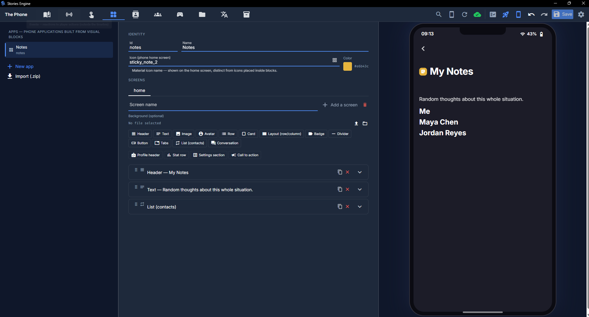

# Custom apps (no-code)

Beyond the built-in apps (Messages, Pixly, Calls, Gallery, Journal, Email, Settings), you can build
your own phone app entirely inside the editor — no coding involved — from the **Apps** tab. Think
a banking app, a note-taking app, a fictional forum, a fake dating app — anything that fits the
"screen made of stacked components" shape.

If you're a developer looking to add a genuinely new native app written in Vue instead (like
Messages or Journal), see [Building a native app in code](../creating-custom-apps.md) — that's a
different, code-based path aimed at extending the engine itself.

## How it works

A custom app is a **screen made of blocks**, stacked and nested. Click (or drag) a block from the
palette to add it, then select its row to fill in its fields on the right — every change shows up
instantly in the live phone preview next to the editor, exactly like editing a chapter's timeline.
Hovering a row in the list outlines the matching element on the phone, and vice versa, so the list
and the live result always read as the same thing. A block inside a Card/Layout is indented under
it, same idea as a folder tree.

An app can have multiple **screens** (switchable via a `tabs` block), and everything you build is
saved as part of your project, ready to export like everything else.

Each screen can also have its own **background** — an image, or a short muted video that loops —
shown behind every block on that screen, with an adjustable opacity so it can sit subtly behind the
content instead of fighting with it. Good for the ambiance of a place or the background noise of a
scene rather than a decorative wallpaper.

## App theme

Every app has its own **Theme** panel (top of the editor, above Screens) — a 5-color palette
(background, surface, text, accent, danger), a font (sans-serif, serif, monospace, or rounded), a
corner-radius scale (sharp/normal/round), and a spacing density (tight/normal/loose). This is what
gives two apps in the same project genuinely different identities — a clean sans-serif wallet next
to a glitchy monospace black-market — without touching CSS.

The theme only fills in what a block doesn't already set itself: a button whose own color you
picked keeps that color regardless of the app's accent; a button with no color set uses the app's
accent instead of the engine's generic default blue. Change the theme any time and every block that
hasn't been individually overridden updates with it. Fonts are limited to families already
installed on the player's device (no live Google Fonts) — a packaged, exported game can't rely on
having internet access to fetch one.

## The block catalog

| Block             | What it does                                                                                                                           |
| ----------------- | -------------------------------------------------------------------------------------------------------------------------------------- |
| **Header**        | A title + icon + color band at the top of a section — can be pinned so it stays visible while scrolling.                               |
| **Footer**        | An action bar (like Row, but built to be pinned to the bottom of the screen) — see [Sticky header/footer](#sticky-headerfooter) below. |
| **Text**          | A paragraph or label, with a style (body, heading, etc).                                                                               |
| **Image**         | A picture, optionally full-bleed.                                                                                                      |
| **Avatar**        | A round profile picture/initial, with a color.                                                                                         |
| **Row**           | An icon + label + optional sublabel + optional chevron — a settings-style list row.                                                    |
| **Card**          | A container with a visible background, for grouping other blocks.                                                                      |
| **Overlay**       | A layer positioned over the normal content — see [Overlay](#overlay) below.                                                            |
| **Sheet**         | A modal (bottom/center/top) that a button opens — see [Sheet](#sheet) below.                                                           |
| **Layout**        | A plain flex container (row or column) with no background — for arranging other blocks without the visual weight of a card.            |
| **Badge**         | A small colored label/pill.                                                                                                            |
| **Divider**       | A horizontal rule.                                                                                                                     |
| **Button**        | See [Buttons](#buttons) below.                                                                                                         |
| **Tabs**          | Switches which screen of the app is currently shown.                                                                                   |
| **List**          | Repeats a block template once per item — see [Lists](#lists) below.                                                                    |
| **Conversations** | A real chat module — see [Conversations](#conversations) below.                                                                        |
| **Schedule**      | A character's routine + current location — see [Schedule](#schedule) below.                                                            |
| **Ledger**        | A numeric collection as a mini-chart + list — see [Ledger](#ledger) below.                                                             |
| **Input field**   | A field the _player_ fills in — see [Input field](#input-field) below.                                                                 |
| **Search**        | A fake search bar over content you write ahead of time — see [Search](#search) below.                                                  |

Every block can be **dragged** between containers (not just reordered in place), **duplicated**,
and given a **condition** — a block whose condition doesn't hold is entirely absent, not just
hidden with CSS, exactly like a timeline entry's `requires`. A handful of presets (a ready-made
profile header, a stats row, etc.) are available to start from instead of building common patterns
block by block.

### Buttons

A button can do one of eight things:

1. **Nothing** — purely visual/decorative.
2. **Apply effects** — the same effects system used everywhere else (flags, phone widgets,
   entities...).
3. **Navigate to a screen** — switch this app's active screen, the same mechanism the Tabs block
   uses.
4. **Fire an event** — emits the `button.pressed` event (with the app id and an optional button id
   you set as payload), which you can react to from the **Events** tab exactly like any other
   trigger — see [Events](conditions-and-flags.md#events). Unlike the other kinds, this is the
   _only_ one that also touches the Events system — picking any other action kind doesn't fire
   `button.pressed` on its own.
5. **Show a message** — briefly displays a short text on screen, no other effect.
6. **Open a sheet** — opens a [Sheet](#sheet) block by its id.
7. **Close the sheet** — closes whichever sheet is currently open, whichever it is.
8. **Open an app** — jumps straight to another app on the phone, native (Messages, Pixly, Journal...)
   or one you built, leaving the current app entirely. Optionally picks one of the target app's own
   screens (if it's a custom app) instead of its default one.

Whichever of the eight you pick, an optional **condition** can gate the whole thing — checked at the
moment the button is tapped, not when the screen renders (that's what a block's own display
condition already does). If the condition doesn't hold, the action is cancelled; you can optionally
show a message explaining why (e.g. "Not enough funds.") instead of the tap silently doing nothing.

### Lists

A `list` block repeats a block **template** — a small subtree you design once — once per item from
one of three sources:

- **Contacts** — every project contact (optionally filtered to only the ones the player follows).
- **A flag collection** — one of your [flag collections](conditions-and-flags.md#flags), so a list
  can display a growing history/ledger/inventory the story has been building up via effects.
- **Entities** — instances of an [entity schema](conditions-and-flags.md#entity-schemas) you've
  defined in the Données tab, for records with more than one field each (a character, an item, a
  transaction...).

Inside the template, text fields can reference the current item with `{item:...}` tokens (a
contact's name, pseudo, follower count, color; a collection item's key/value; or, for an entity
list, one token per field of that schema — `{item:<fieldKey>}`).

For an entity specifically, you're not limited to inside a list template: `{entity:<schemaId>:<entityId>:<field>}`
works in **any** text field anywhere in the app builder, no list needed — use `*` as the entity id
to mean "the first/only instance of that schema" (the common case for a singleton record like a
wallet or a settings object), or a specific id to address one instance among several.

### Conversations

The `conversations` block is the one genuinely interactive block — a full chat module (a thread
list plus a message view with choice-driven replies), reusing the exact same underlying engine as
Pixly's native DMs. Thread **definitions** (who's in a group, its name) come from the project's own
**Threads** tab, same as everywhere else — you don't re-author who's in a conversation separately
per app. Only the actual **message history** is kept separate per app, so a custom app's chat never
mixes with native Messages/DM or with another custom app's own conversations.

To script messages into a custom app's conversation from the timeline, use the **DM (app)**
("appDm") entry type and an app-scoped **choice**, both of which appear in the timeline's "add
entry" menu once your app has a `conversations` block somewhere. If you send a player straight into
a custom app's conversation via a `timeskip`'s landing option (see
[Writing chapters](writing-chapters.md)), the unread badge/notification for that exact thread is
suppressed the same way it would be for a conversation the player already has open.

### Schedule

The `schedule` block shows one entity's own routine — pick a schema, a field on it typed
**Schedule**, and (if that schema has more than one instance) which one. It renders as a day
timeline: every slot you authored (a "from" time, a "to" time, a place), with whichever one covers
the story's _current_ in-fiction time highlighted, plus a "right now" summary line at the top.

A **Schedule**-typed field is authored on the schema itself (Données tab → Schémas, same place you
add any other field) as a list of time slots — no JSON, no free text, just from/to/place rows. This
is what makes a tracking-style app possible: define a schema for a character with a Schedule field,
author their day (seed instances, so it's there from the start — see
[Entity schemas](conditions-and-flags.md#entity-schemas)), and a `schedule` block anywhere shows
where they are right now, recalculated live as the story's clock moves.

### Ledger

The `ledger` block picks a [flag collection](conditions-and-flags.md#flags) — the same one the
`list` block's "Collection" source reads — and renders it as a mini area-chart (most recent value
front and center, a line tracing every entry) plus the entry list underneath. Nothing new to
author: any collection you already build via effects (`add`/`increment` — a wallet balance, a
reputation score, a running total) becomes a real chart the moment you point a `ledger` block at
it, no separate chart data to maintain. A non-numeric collection still lists its entries, just
without the chart on top.

### Input field

Every other block shows something _you_ authored. `form` is the one that lets the **player** type
or pick a value themselves — a name, a code, a guess — writing it straight into a flag or an entity
field, no button or effect needed on top.

- **Target a flag**: pick which one and an input kind (text, number, or yes/no) — a flag has no
  type of its own, so you choose one here.
- **Target an entity field**: pick a schema, then one of its fields — the input automatically
  matches that field's own type (text, number, yes/no, or a contact picker). Schedule and
  reference-to-another-schema fields aren't offered here; they're structured data, not a fit for a
  single field.

Like [Schedule](#schedule), an entity target uses `*` for "the first/only instance" or a specific
id to address one among several.

Below the target, choose **when the typed value is actually written**:

- **Live** — every keystroke writes immediately (the original, still-default behavior — fine for a
  quick numeric jog, but a text field left mid-edit briefly holds a half-typed value).
- **On leaving the field** — commits once the player clicks/tabs away, so partial typing never
  touches the flag or entity field.
- **"Submit" button** — the field shows a separate button; nothing is written until the player taps
  it, letting them back out of an edit entirely.

**Read-only** shows the current value without letting the player edit it at all — useful for mixing
a genuinely editable field with a computed one displayed the same way.

### Sticky header/footer

**Header** has a **Pinned to the top** toggle — enable it and the header stays visible at the top
of the screen while everything below it scrolls underneath, instead of scrolling away with the rest
of the content. Off by default, so every existing header keeps behaving exactly as before.

**Footer** is a new block for the opposite case — an action bar (buttons, usually) pinned to the
**bottom** of the screen, like a "Submit" bar that should always stay reachable in a long form. It's
a container (row or column, like Layout) that holds its own blocks, with **Pinned to the bottom**
on by default — turn it off if you want the footer's visual style without actually fixing it in
place.

### Overlay

An `overlay` block holds its own blocks and positions them over the normal content — a floating
badge, a small bubble, a tooltip — instead of taking up space in the row/column flow like every
other block. Pick where it sits: top-left, top-right, bottom-left, bottom-right, or center.

It anchors to whichever **Card** or **Layout** it's nested inside — placed at a screen's root
level, it anchors to the whole screen; placed inside a Card, it anchors to just that card's own
corner/center instead. There's no way to anchor it to an arbitrary block by name — nesting is how
you pick what it's positioned against.

### Sheet

A `sheet` block holds its own blocks but is invisible by default — it only appears when a button's
**Open a sheet** action targets its id, over everything else. Give it a unique **id** so a button
knows which one to open, and pick where it docks:

- **Bottom** (default) — slides up from the bottom, like an iOS action sheet.
- **Center** — a plain centered dialog, fading + scaling in instead of sliding.
- **Top** — the same panel as Bottom, mirrored to the top edge.

The player can dismiss it by tapping outside it, or you can add a button inside it with the
**Close the sheet** action. Only one sheet is ever open at a time, and switching screens always
closes it — a sheet belongs to the screen it's authored on.

### Search

A `search` block is a search bar over **results you write ahead of time** — each result is a
title, an excerpt, and a source, and can be gated by its own condition (`requires`), so a result
only becomes findable once the player has actually discovered whatever it's gated on. Good for
archives, a fake forum, a search engine, or any internal database the player consults.

The player has to actually type something — nothing shows until they do, same as a real search
engine, not a browsable list with a filter on top. Every word they type has to appear somewhere in
a result's title, excerpt, or source for it to show up (searching "red key" only matches a result
that mentions both "red" and "key" somewhere).

## Variables and translation

Any text field on a block can interpolate live values with `{...}` tokens — `{flag:someKey}` for a
flag's current value, plus fixed tokens like `{playerName}`, `{battery}`, `{steps}`,
`{stepsGoal}`, `{weather}` — with a "Variable" button next to each relevant field, same idea as the
emoji picker button found throughout the editor.

A custom app's text goes through the same "common" translation bucket as contact names and bios —
see [Translations](assets-and-translations.md#translations) — so it's translated the same way as
everything else that isn't tied to one specific chapter.

## Icons

Every icon field in the project — a custom app's own icon on the home screen, a block's icon, an
interaction step's icon — uses the same **icon picker** (a searchable Material-icon browser), not
just custom apps specifically.

## Storage and sharing

A custom app is stored as one file, `apps/<id>.json` — plain JSON, not executable code. This makes
it easy to export a single app (data + whatever assets it references) as a `.zip` and import it
into a _different_ project — asset paths get renamed to avoid collisions with anything already in
the target project's `assets/` folder, and the app's own id is de-collided too if needed. Handy for
reusing a "settings-style app" you built once across multiple stories.

## Enabling and ordering

Like every native app, a custom app appears in the **Game** tab's Applications panel, where you can
toggle it on/off per project and drag it into whatever home-screen order you want, right alongside
Messages/Pixly/etc. — native and custom apps share one merged list, with no special treatment for
either kind.

## Next steps

- [Conditions, flags, and reactions](conditions-and-flags.md) — the condition/effects system
  blocks and buttons plug into.
- [Assets, sound, and translations](assets-and-translations.md) — importing images your blocks
  reference, and translating your app's text.
