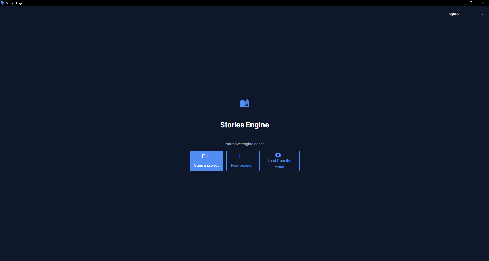
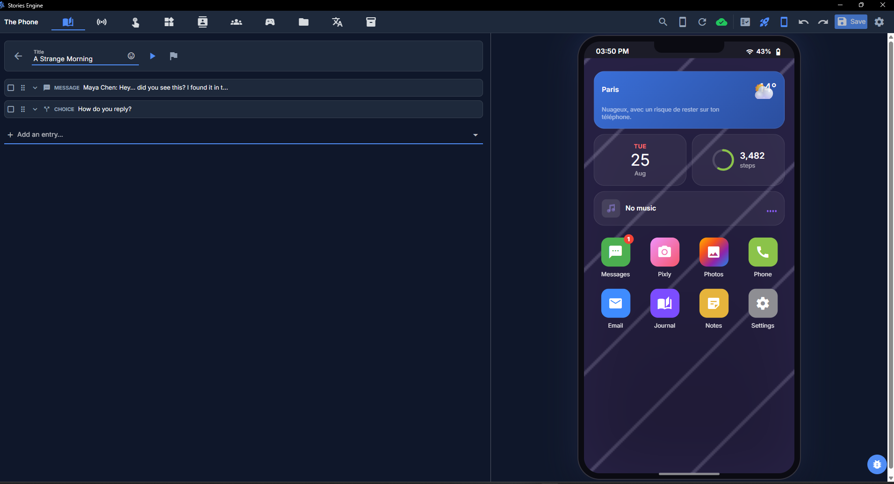

# Getting started

Stories Engine is an editor for writing narrative games that a player experiences through a fake
smartphone — texts, a social-media app, calls, photos, a journal. You write the story once, in the
editor; you (or anyone) can then export it as a standalone app that runs on Windows, macOS, Linux,
or Android, with no need for the engine itself, an internet connection, or any account.

This page covers installing the app and finding your way around it for the first time. See the
[table of contents](README.md) for everything else.

## Installing

Grab the latest build for your platform from the project's releases page (see the main
[README](../../README.md) for links) — this is the editor, not a story. It runs like any other
desktop app; no separate runtime to install.

If you're setting up a development copy from source instead (to contribute code, or to build the
editor yourself), see the main README's "For developers" section.

## Opening the editor for the first time

The editor opens to a project picker. From here you can:

- **Open an existing project** — point it at a project folder (see
  [how a project is organized](writing-chapters.md#how-a-project-is-organized) for what that
  folder looks like).
- **Create a new project** — pick a name and a parent folder; the editor scaffolds a minimal
  starting point for you (one empty chapter, a single "you" contact, empty contact/thread lists).
- **Load a project from the cloud** — if you've previously pushed a project to your own cloud
  storage (see [cloud sync](building-and-exporting.md#cloud-sync)), you can pull a copy down here
  without opening anything locally first.

## The editor's layout

Once a project is open, you're looking at two halves side by side: the **authoring panel** on one
side (tabs across the top) and a **live phone preview** on the other, which updates instantly as
you edit — no save button to remember, no "refresh preview" step for most changes.

The tabs across the top of the authoring panel:

| Tab | What it's for |
|---|---|
| **Chapters** | The chapter graph and, inside each chapter, its timeline — this is where most of your writing happens. See [Writing chapters](writing-chapters.md). |
| **Events** | Reactions to things the player does (opening an app, liking a post...) rather than things that happen on a fixed point in the timeline. See [Events](conditions-and-flags.md#events). |
| **Interactions** | Authored phone gestures — tap, hold, swipe, a passcode — for moments where the player physically "does something" with the phone. See [Interactions](conditions-and-flags.md#interactions). |
| **Apps** | The no-code custom app builder. See [Custom apps](custom-apps-nocode.md). |
| **Contacts** | Everyone the player can text, call, or see on the social feed. See [Contacts and threads](writing-chapters.md#contacts-and-threads). |
| **Threads** | Group chat definitions (a 1:1 conversation needs no entry here — just a contact). |
| **Game** | Project-wide settings: title, applications toggle/reorder, flags catalog, the mature-content warning, sound overrides, the build icon. |
| **Assets** | Your project's images and audio files — import, browse, see what's used vs. orphaned. See [Assets](assets-and-translations.md#assets). |
| **i18n** | The narrative translation editor — see [Translations](assets-and-translations.md#translations). |
| **Seed** | Backlog content (old texts, old posts) that already exists when the player starts, without playing out live. |

## Your first chapter

A brand-new project starts with one empty chapter. Click it open, and you'll see an empty
**timeline** — the ordered sequence of things that happen in this chapter (a text arrives, a
choice appears, a photo shows up in the gallery...). Use "Add entry" to add your first one; a
`message` (an incoming text) is the simplest place to start.

Every entry you add appears instantly in the phone preview on the other side of the screen. Try
adding a couple of `message` entries and watch them show up as SMS bubbles as you type.

For the full list of entry types and what each one does, see
[The timeline and its entry types](writing-chapters.md#the-timeline-and-its-entry-types).

## The chapter graph

Zoom out from a single chapter and you'll see the **chapter graph** — every chapter in your
project as a draggable card, connected by arrows you draw yourself. This is your story's actual
branching structure. See [The chapter graph](writing-chapters.md#the-chapter-graph) for the full
picture — conditions on arrows, duplicating chapters, endings, and more.

## Running the preview

The phone preview on the right is always live — there's no separate "run" step. A few useful
controls live around it:

- **Restart preview** — resets the live session (flags, messages, everything) back to a fresh
  start, replaying the setup wizard.
- **Preview from this chapter** (on each chapter-graph node) — jumps the preview straight into that
  chapter, filling in a placeholder player name/color/language if you haven't gone through the
  setup wizard yet in this session. Useful for testing a scene deep in your story without
  replaying everything before it.
- **Full-screen preview** — expands the phone to fill the window, useful for actually reading long
  passages or checking layout.

The preview is powered by the exact same engine code that ships in an exported game — what you see
here is what a player sees, not an approximation.

## Next steps

- [Writing chapters](writing-chapters.md) — the full timeline entry-type reference, contacts,
  threads, seed content, endings.
- [Conditions, flags, and reactions](conditions-and-flags.md) — making your story actually branch.
- [Building and exporting](building-and-exporting.md) — when you're ready to share what you've
  made.
